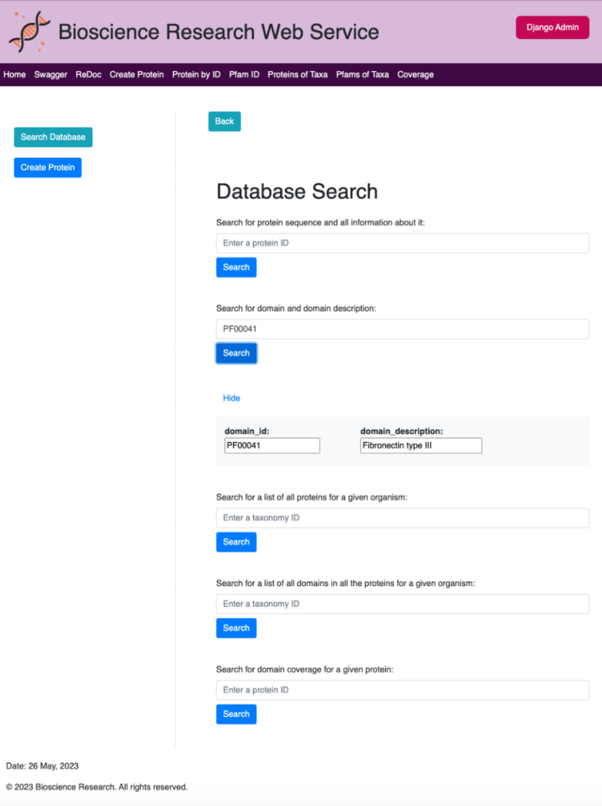

# Bioscience Research Portal

## Table of Contents

Welcome to the Bioscience Research platform, designed to enhance data retrieval and streamline the process of creating new proteins for researchers. With a user-friendly interface and a RESTful web service, this platform provides a seamless experience for accessing and using data. Its primary goal is to simplify research, allowing scientists to quickly find the information they need to advance their studies and drive innovative discoveries.

1. [Django Admin Login](#django-admin-login)
2. [Development Environment](#development-environment)
3. [Project Setup and Installation](#project-setup-and-installation)
4. [Test Search Database Functionality](#test-search-database-functionality)
5. [Test Add New Protein](#test-add-new-protein)
6. [Unit Tests Instructions](#unit-tests-instructions)
7. [Entity Relationship Diagram](#entity-relationship-diagram)
7. [Swagger](#swagger)
8. [Final Design](#final-design)

### **Django Admin Login**

Username: XXXXX
Password: XXXXX

In the event of login problem, please create a new superuser and follow terminal instructions

	python manage.py createsuperuser

### **Development Environment**
Operating System: Project was developed on MacOS Ventura 13.3.1 (a) 
Browser Testing: Project was tested in Chrome Browser
Python version: Python 3.10.9

Database: SQLite3
Configuration: os.path.join(BASE_DIR, 'db.sqlite3') 
Path: relative  -> 'os.path.join' joins base directory with 'db.sqlite3' to make the database location relative to the location of the Django project

### **Project Setup and Installation**

1. Unzip the project folder

2. Navigate to the project directory
	cd [file name]

3. Create a virtual environment
	python3.10 -m venv venv

4. Activate the virtual environment
	source biovenv/bin/activate

5. Install the dependencies
	pip install -r requirements.txt

6. Navigate to the source folder
	cd src

7. Migrate the database
	python manage.py migrate

8. Load Bulk Data
	python scripts/load_data.py

9. Start the development server
	python manage.py runserver

10. Visit localhost to view the project
	http://127.0.0.1:8000/

If installation was unsuccessful
•	review installation errors in terminal 
•	review documentation to solve errors

### **Test Search Database Functionality**

To search for protein sequence and all information about it use these:

- A0A016SS41
- A0A016T911
- A0A016TEY5
- A0A016TQ94
- A0A016TTS1

To search for domain and domain description use these:

- PF00008
- PF00010
- PF00011
- PF00012
- PF00013

To search for a list of all proteins for a given organism:

- 53326
- 7160
- 30076
- 34607
- 251391

To search for a list of all domains in all the proteins for a given organism use these:

- 6282
- 691883
- 71139
- 1291522
- 49390

To search for domain coverage for a given protein use these:

- A0A016U0V3
- A0A016U557
- A0A016U701
- A0A016UJ17
- A0A016USI4

### **Test Add New Protein**

        {
            "protein_id": "testNewProtein1234",
            "sequence": "MAGQRRNENLSEAMQRLQMGEDKSALNSPKYPAVPNYIRQHAGNTPIQQQSAEEYKLYERTNIIASSKYATPRPIEQLAADTNINNVPISQPVSNGIGPTAGNSSLYTGRNVMYEKKLSTKQSPVYENLEFCGGVVGIPTDSYFESTHKRAQPQSPTANPSRGQYMIMHASTSGGRFAHTPVPEHHADTAPIYENIIPHSGQRAQPQASPATATIYQHzsxdcAEISPQLSGAGNGALTPLAPHHIRENSGLDMSAVLASPMHRRSTSNSSLKTAASNSTAAATAGGSGLSSPTQRYRNLSLPSHPNSIQTSPAKSLASSTASSNDYKLLQHTPIKNTHHIPTHHPIINVSVNPNYIEEINSSDYVCMTANLHRQPARSPTAGVQPLRSNTTALASSSSGYRKLCNESPVYVGSSSGGSELDKQSALSGARKISPMSERKFTQSPLAIPQRPLSSGGAAASSISPTPSQNSTGLSKNLLPYSVTPPRPTGPTEAQRKIEELTRQLEEEIEQSEEQGEYFGICHTCGDKVKGAGQACQAMGNLYHTNCFICCSCGRALRGKAFYNVHGRVYCEEDYMYSGFQQTAEKCAICGHLIMEMILQAMGKSYHPGCFRCCICNECLDGVPFTVDVDHKIYCVNDYHRMFAPKCASCGKGITPVEGTDETVRVVSMDKDFHVDCYICEECGMQLTDEPDKRCYPLDGRLLCRSCHLQCLAMQQSSPHIRHQEPVCASYQYMG",
            "taxonomy": {
                "taxa_id": 2745354771,
                "clade": "E",
                "genus": "Bachtrocerai",
                "species": "dorfhsailis"
            },
            "length": 730,
            "domains": [
                {
                    "pfam_id": {
                        "domain_id": "A2PF004121",
                        "domain_description": "Zinchr finger LIM-type"
                    },
                    "description": "Zinc finger LIrhM-type",
                    "start": 582,
                    "stop": 638
                }
            ]
        }

### **Unit Tests Instructions**

1. test_forms.py: 18 passing tests 

		python manage.py test bioscience_app.tests.test_forms

2. test_models.py: 25 passing tests, 8 failing tests (commented out)

	passing tests: 
		
		python manage.py test bioscience_app.tests.test_models

	failing tests: uncomment the code to run the following command 
		
		python manage.py test bioscience_app.tests.test_models

3. test_serializers.py: 11 passing tests, 7 failing tests (commented out)

	passing tests:

		python manage.py test bioscience_app.tests.test_serializers
	
	failing tests: uncomment the code to run the following command
		
		python manage.py test bioscience_app.tests.test_serializers

4. test_views_api.py: 36 passing tests
	
		python manage.py test bioscience_app.tests.test_views_api

5. test_views_protein.py: 5 passing tests
	
		python manage.py test bioscience_app.tests.test_views_protein

6. test_views.py: 4 passing tests
	
		python manage.py test bioscience_app.tests.test_views

7. run all passing tests: 99 tests
		
		python manage.py test

8. run failing tests, please uncomment the code in test_models.py and test_serializers.py then run: 	
		python manage.py test

### **Entity Relationship Diagram**

### **Swagger**

### **Final Design**

*Author: https://github.com/randomoi/*
